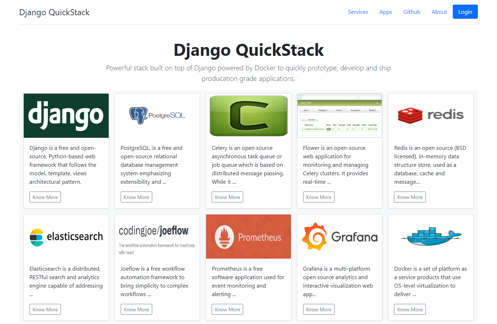
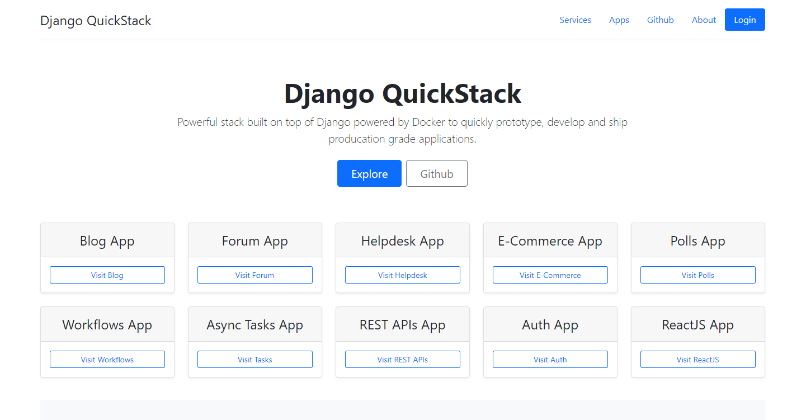

#### Django-QuickStack

Django-QuickStack is an open-source tech stack powered by Docker, that leverages various services and ready-to-use Django apps to supercharge Python developers' productivity and efficiency.

We all know that Django is already an awesome batteries included framework. However, Django-QuickStack is our vision to put *Django on Steroids*.


### Our Mission

Developers often spend significant time configuring, building, and launching apps that require common use-cases such as REST APIs, frontend-backend integration, or configuring apps like blogs, helpdesk, forums, and handling async tasks and system performance monitoring. These tasks are ubiquitous across industries and can delay project start times by days or weeks, hampering the development of unique business logic and functionalities.

To address this, Django-QuickStack integrates 10 essential services and 10 ready-to-use apps, enabling developers to swiftly launch projects and dive into real development within minutes. Powered by Docker, this tech stack minimizes setup and configuration time, allowing developers to focus on implementing their custom business logic and features promptly.


### Demo/Screenshot

These services and django apps can be easily spinned up using Docker and ready to be explored, reviewed and testing.








### Services Included in Django-Stack

These services are spinned up using Docker-Compose

- **Server**: Backend powered by Django and conisiting 10 apps  
- **Frontend**: ReactJS app connected to Django Backend using REST APIs 
- **Nginx**: for serving web app
- **Worker**: for executing async tasks using Celery workers
- **Flower**: for monitoring Celery workers and tasks
- **Redis**: as a message broker for Celery async tasks
- **DB**: postgres database instance
- **ElasticSearch**: for integrating search functionality in Django apps
- **Prometheus**: for Django app monitoring and event tracking
- **Grafana**: for building visualization, graphs to easier monitoring via Prometheus


### Apps Included in Django-Stack

These apps are custom built and provide a good jumpstart so that you can configure and build your custom business logic.

- **Blog app**: a fully functional blogging app having features equvilant to standard blogging platforms like Wordpress, etc.
- **Forum app**: a forum app allowing creating topics, discussions, comments, moderation
- **Helpdesk app**: a help desk app allowing tickets, teams, status alerts, monitoring, email notifications
- **Polls app**: a polling app allowing creating questions and getting votes
- **E-Commerce app**: a basic e-commerce app. Currently, it's WIP
- **REST APIs app**: a fully functional REST API framework allowing creating APIs, rate limits, authentication and protecting routes, etc.
- **Workflows app**: a state machine workflow builder app with 2 sample workflows i.e. user welcome and shipping workflows
- **Async Tasks app**: a fully functional async tasks app allowing you to run and monistor tasks background in background  
- **Accounts app**: allows login, registration of non-staff users, can be extended to use social logins
- **ReactJS app**: simple reactjs app showing how backend and frontend connect
- **Monitoring apps**s: for services like Celery/Flower, Prometheus/Grafana at different ports.

Our apps stack allows you to easily configure, extend, drop or customize any of above apps as per your business needs. We've provided very basic business logic that you can take inspiration from or drop it to write your own.


### Project Structure

```
.
├── backend
│   ├── accounts/
│   ├── async_tasks/
│   ├── backend/
│   ├── blog_app/
│   ├── ecommerce/
│   ├── forum_app/
│   ├── helpdesk_app/
│   ├── manage.py
│   ├── polls/
│   ├── rest_api/
│   ├── sample-data.py/
│   ├── state_machine_workflows/
│   └── templates/
├── docker
│   ├── backend
│   │   ├── Dockerfile
│   │   ├── flower-entrypoint.sh
│   │   ├── server-entrypoint.sh
│   │   └── worker-entrypoint.sh
│   ├── frontend
│   │   ├── Dockerfile
│   │   └── react-entrypoint.sh
│   ├── nginx
│   │   └── default.conf
│   └── prometheus
│       └── prometheus.yml
├── docker-compose.yml
├── frontend
│   ├── package.json
│   ├── package-lock.json
│   ├── public
│   ├── README.md
│   └── src
├── README.md
└── requirements.txt
```

### Developing locally using Docker-Compose

1. Close this repository to your development machine
2. Install docker and docker-compose using these [instructions](https://docs.docker.com/engine/install/)
3. Run `docker compose build` command to build images
4. Run `docker compose up` to launch services
5. Visit `0.0.0.0` to access web app and services at respective ports


### Developing locally using Django or ReactJS

1. Close this repository to your development machine
2. Install services like Postgres, Redis, Nginx, etc
3. Install Python dependencies using `requirements.txt` file
4. Run Django using `python manage.py runserver` and access at `localhost:8000`
5. Install NodeJS dependencies using `frontned/package.json` file.
6. Run ReactJS using `npm start` and access at `localhost:3005`


### Support

Create an issue on Github if you find any bug. You're welcome to send PR requests.

### Future Roadmap

- Improve apps to provide more features, for example, our e-commerce app is quite basic as of now and lacks features like sellers, shipping tracking, payment, etc.
- Create similar tech stacks for other technologies like NodeJS, PHP, Ruby, Go, etc. to provide developers with more choices.

### Credits

- Bolerplate code for some apps, packages was inspired from various open-source Github repositories.
- We'll update a FREE TO USE kind of license soon.
